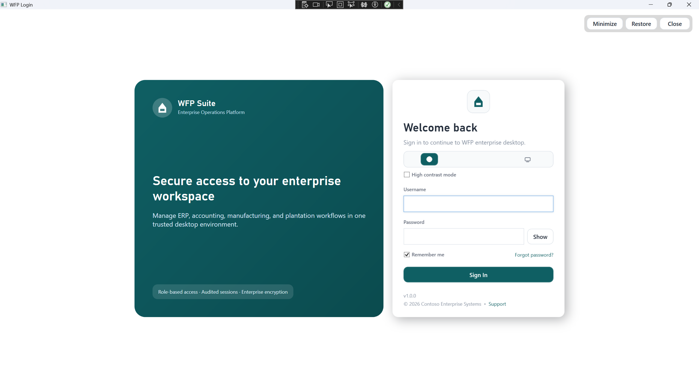
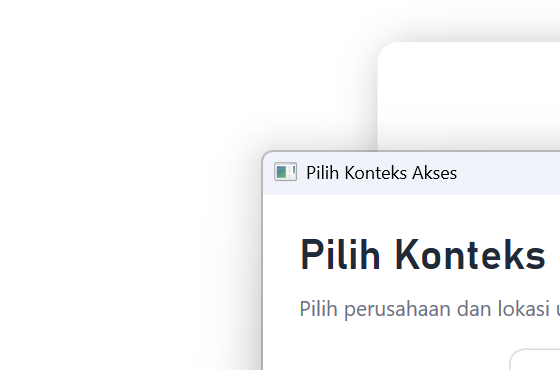
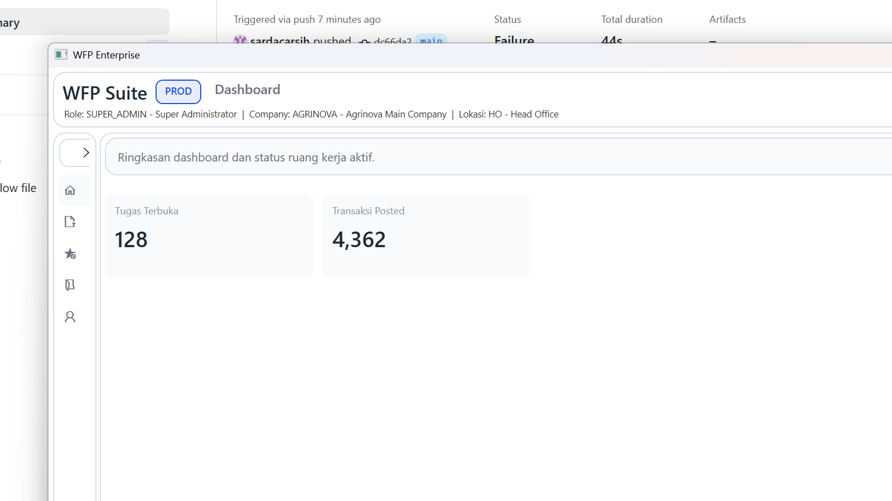

# Accounting WPF


Desktop accounting application built with WPF on .NET 8 and PostgreSQL.

This project includes:
- username/password login against PostgreSQL
- role-based access control with company and location scoping
- General Ledger workflows for journal entry, posting, reporting, and period close
- inventory integration and dedicated inventory import RBAC actions
- estate hierarchy (Estate > Division > Block) master data with XLSX import/export
- service-level integration tests against a live PostgreSQL database

## Highlights

- Action-based RBAC with company and location scope
- Multi-step journal approval and posting workflow
- Financial report export to XLSX
- Estate hierarchy management with bulk XLSX import/export
- PostgreSQL-backed auth, access, and accounting services
- Integration-test harness for database-backed workflows

## Tech Stack

- .NET 8
- WPF
- PostgreSQL
- Npgsql

## Current Functional Areas

- Authentication and access-context selection
- User, role, company, and location administration
- General Ledger master data
- Journal workflow: `DRAFT -> SUBMITTED -> APPROVED -> POSTED`
- Financial reports:
  - Trial Balance
  - Profit and Loss
  - Balance Sheet
  - General Ledger
  - Sub Ledger
  - Cash Flow
  - Account Mutation
- Accounting period open/close workflow
- Estate hierarchy master data (Estate > Division > Block)
- XLSX import/export for estate hierarchy and GL accounts
- Block and subledger selection dialogs for journal posting
- Inventory sync/import permission model

## Prerequisites

- Windows
- .NET 8 SDK
- PostgreSQL
- PowerShell
- DevExpress 24.1 local packages installed on the machine

## Getting Started

### 1. Configure local settings

This repo ships with [`appsettings.example.json`](D:/VSCODE/wpf/appsettings.example.json). Create a local `appsettings.json` from it and fill in your database connection.

Expected local config shape:

```json
{
  "DatabaseAuth": {
    "ConnectionString": "Host=127.0.0.1;Port=5432;Database=your_database;Username=your_user;Password=your_password;Pooling=true;Timeout=8;Command Timeout=8;",
    "UsersTable": "public.app_users",
    "QueryTimeoutSeconds": 8
  },
  "CentralSync": {
    "BaseUrl": "",
    "ApiKey": "",
    "UploadPath": "/api/inventory/sync/upload",
    "DownloadPath": "/api/inventory/sync/download",
    "TimeoutSeconds": 30
  }
}
```

You can also override the database configuration with environment variables:

- `AGRINOVA_PG_CONNECTION`
- `AGRINOVA_AUTH_USERS_TABLE`
- `AGRINOVA_AUTH_QUERY_TIMEOUT`

PowerShell example:

```powershell
$env:AGRINOVA_PG_CONNECTION = "Host=127.0.0.1;Port=5432;Database=agrinova_accounting;Username=agrinova;Password=your_password;Pooling=true;Timeout=8;Command Timeout=8;"
$env:AGRINOVA_AUTH_USERS_TABLE = "public.app_users"
$env:AGRINOVA_AUTH_QUERY_TIMEOUT = "8"
```

### 2. Initialize the database

Run the core auth and RBAC schema first:

- [`database/init_auth.sql`](D:/VSCODE/wpf/database/init_auth.sql)

Then run the production-oriented GL account master migration:

- [`database/init_gl_accounts_master.sql`](D:/VSCODE/wpf/database/init_gl_accounts_master.sql)

For existing environments that already use the GL schema and still reject account codes like `HO.33000.001` or `KB.51000.001`, run the compatibility patch:

- [`database/allow_alphanumeric_account_prefix.sql`](D:/VSCODE/wpf/database/allow_alphanumeric_account_prefix.sql)

Available database scripts:

- `init_auth.sql`
- `init_gl_accounts_master.sql`
- `allow_alphanumeric_account_prefix.sql`
- `init_inventory.sql`
- `gl_accounts_regression_checks.sql`
- `gl_accounts_cleanup_candidates.sql`
- `backfill_inventory_api_inv_import_actions.sql`
- `verify_inventory_api_inv_import_actions.sql`
- `lock_gl_inventory_role_policy.sql`
- `migrate_module_to_scope.sql`
- `purge_inactive_gl_accounts_safe.sql`
- `reseed_gl_accounts_20_80_81.sql`
- `verify_gl_accounts_workbook_company1.sql`
- `assign_uat_users.sql`

Official COA reseed path for `company_id = 1`:

- [`scripts/reseed_gl_accounts_company1_from_workbook.ps1`](D:/VSCODE/wpf/scripts/reseed_gl_accounts_company1_from_workbook.ps1)
- [`database/reseed_gl_accounts_20_80_81.sql`](D:/VSCODE/wpf/database/reseed_gl_accounts_20_80_81.sql)
- [`database/verify_gl_accounts_workbook_company1.sql`](D:/VSCODE/wpf/database/verify_gl_accounts_workbook_company1.sql)

### 3. Default login

Seed credentials from the auth script:

- Username: `admin`
- Password: `Admin@123`

### 4. Run the app

```powershell
dotnet run --project .\Accounting.csproj
```

This repo also includes a local [`NuGet.Config`](D:/VSCODE/wpf/NuGet.Config) so `dotnet restore`, `dotnet build`, and the integration test project can use local package sources in offline or restricted-network environments.

## RBAC Notes

The app uses action-based RBAC. Recent accounting and inventory changes split read/import/export permissions into dedicated actions.

Examples:

- `accounting.reports.view`
- `accounting.reports.export`
- `accounting.transactions.import`
- `accounting.transactions.export`
- `inventory.api_inv.download_import_template`
- `inventory.api_inv.import_master_data`
- `master_data.create`
- `master_data.update`
- `master_data.delete`
- `master_data.import_master_data`

Important behavior:

- General Ledger navigation is exposed from explicit `view` permissions.
- Journal import and journal export require their dedicated transaction actions.
- Report XLSX export requires `accounting.reports.export`.

For existing environments that were initialized before the inventory RBAC split, run:

- [`database/backfill_inventory_api_inv_import_actions.sql`](D:/VSCODE/wpf/database/backfill_inventory_api_inv_import_actions.sql)
- [`database/verify_inventory_api_inv_import_actions.sql`](D:/VSCODE/wpf/database/verify_inventory_api_inv_import_actions.sql)

Deployment notes are in [`database/DEPLOYMENT_CHECKLIST.md`](D:/VSCODE/wpf/database/DEPLOYMENT_CHECKLIST.md).

## Password Hash Format

Expected format:

`pbkdf2-sha256$<iterations>$<base64_salt>$<base64_hash>`

Generate a hash with:

```powershell
powershell -ExecutionPolicy Bypass -File .\scripts\New-AgrInovaPasswordHash.ps1 -Password "Password123!"
```

## Reporting and Period Close

Reports are sourced from `gl_ledger_entries`, which are generated when journals are posted.

Period close currently includes:

- rejection when the target month still has journals not yet `POSTED`
- automatic creation of a closing journal
- transfer of `REVENUE` and `EXPENSE` balances into retained earnings
- accounting-equation validation during post/close flow

## Account Code Format

GL account codes use the format `99.99999.999`.

- The first segment is a 2-character account type
- The second and third segments are numeric
- The supported workbook-driven COA families in this repo are `20`, `80`, and `81`
- Existing databases that still enforce the old numeric-only prefix rule should run [`database/allow_alphanumeric_account_prefix.sql`](D:/VSCODE/wpf/database/allow_alphanumeric_account_prefix.sql)

## Screenshots

### Login



### Access Selection



### Main Shell



Additional workspace screenshots can be added later for reports, journals, and inventory details.

## Integration Tests

The integration tests run against a real PostgreSQL database.

Run them with:

```powershell
dotnet run --project .\tools\IntegrationTests\IntegrationTests.csproj
```

If needed, set the database connection first:

```powershell
$env:AGRINOVA_PG_CONNECTION = "Host=127.0.0.1;Port=5432;Database=agrinova_accounting;Username=agrinova;Password=your_password;Pooling=true;Timeout=8;Command Timeout=8;"
dotnet run --project .\tools\IntegrationTests\IntegrationTests.csproj
```

## Project Layout

```text
Controls/        Reusable WPF controls
Converters/      WPF value converters
Infrastructure/  Commands, logging, and shared plumbing
Resources/       Application resources and styling assets
Services/        PostgreSQL access, RBAC, journals, reports, inventory, and workflows
ViewModels/      UI state and workflow orchestration
Views/           WPF views and workspace components
database/        SQL bootstrap, migrations, and verification scripts
scripts/         Utility scripts such as password hash generation
tools/           Integration test harness and support tools
```

## Roadmap

- Complete remaining placeholder accounting menus such as custom reports and budgeting workflows
- Expand automated coverage for more RBAC combinations and UI-level regressions
- Improve deployment/bootstrap guidance for fresh and existing environments
- Add release packaging guidance for non-developer Windows deployments

## Known Limitations

- Integration tests require a live PostgreSQL database and are not isolated with local containers in this repo
- Some accounting menus are present as structural placeholders and are not fully implemented yet
- Local runtime configuration is file-based and expects per-machine setup through `appsettings.json` or environment variables
- CI currently validates build health only and does not run database-backed integration tests in GitHub Actions

## Contributing

1. Create a feature branch for your change.
2. Keep secrets out of source control and use `appsettings.example.json` as the committed template.
3. Run a local build before opening a PR:

```powershell
$env:NUGET_PACKAGES = "D:\VSCODE\wpf\.nuget\packages"
dotnet build .\Accounting.csproj --packages D:\VSCODE\wpf\.nuget\packages -nologo
```

4. Run integration tests when your change touches database, RBAC, journal, inventory, or reporting behavior:

```powershell
dotnet run --project .\tools\IntegrationTests\IntegrationTests.csproj --packages D:\VSCODE\wpf\.nuget\packages
```

5. Document any required SQL migration or backfill in the `database/` folder and mention it in the PR summary.

Full contributor guidance is available in [`CONTRIBUTING.md`](D:/VSCODE/wpf/CONTRIBUTING.md).

## License

This repository is licensed under the MIT License. See [`LICENSE`](D:/VSCODE/wpf/LICENSE).

## Changelog

See [`CHANGELOG.md`](D:/VSCODE/wpf/CHANGELOG.md) for the current release history.

## Security

For responsible disclosure guidance, see [`SECURITY.md`](D:/VSCODE/wpf/SECURITY.md).

## Release Process

Use [`RELEASE_CHECKLIST.md`](D:/VSCODE/wpf/RELEASE_CHECKLIST.md) before cutting a release or deployment build.

## Publish Safety

This repo ignores local secrets and generated outputs via [`.gitignore`](D:/VSCODE/wpf/.gitignore).

Notably ignored:

- `appsettings.json`
- `.vs/`
- `bin/`
- `obj/`
- `artifacts/`

Use `appsettings.example.json` as the committed template for new environments.
